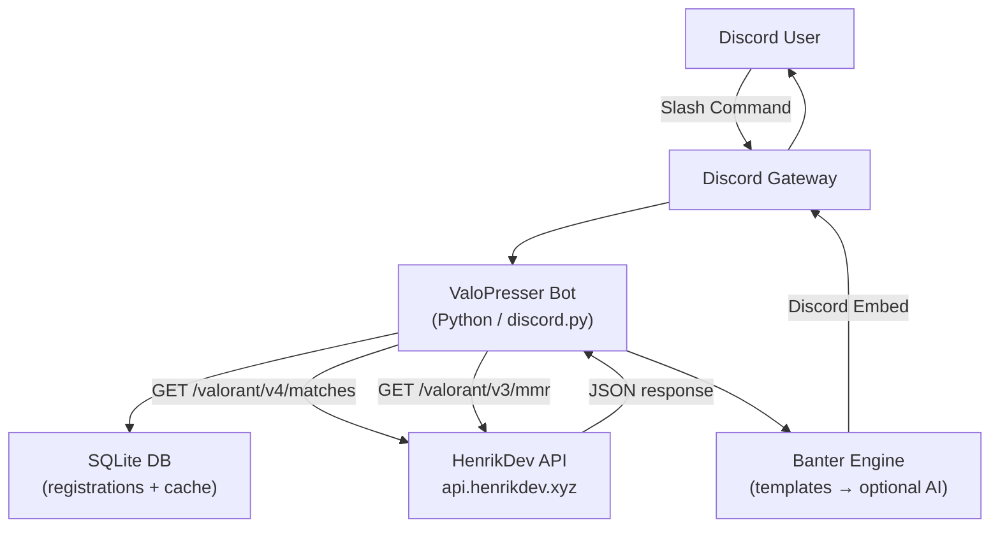

# ValoPresser Bot — Product Requirements Document

**Version:** 0.1 (Draft)
**Last Updated:** May 26, 2026
**Status:** Living Document — subject to revision as development progresses

---

## 1. Vision & Goals

### 1.1 Overview
ValoPresser Bot is a Discord bot for a private friend-group server. It pulls publicly available Valorant statistics for registered members and presents them with banter, roasts, and trash-talk baked in. Think of it as the group chat's most brutally honest Valorant analyst — it knows your KDA and it's not going to let you forget it.

### 1.2 Tagline
> "Your squad's most brutally honest Valorant analyst."

### 1.3 Goals
- Allow Discord server members to voluntarily link their Riot ID to their Discord account
- Fetch and display their recent Valorant performance stats in a readable, styled embed
- Enable friend-group comparisons with automatic banter based on actual stat differences
- Build a foundation that can grow from template-based banter into AI-generated roasts

### 1.4 Non-Goals (Phase 1)
- This is **not** a public bot intended for thousands of servers
- No RSO/OAuth authentication flow — stats are fetched from public data only
- No web dashboard or external website
- No ranked match manipulation, tournament features, or live game tracking

---

## 2. Target Users

| User Type | Description |
|---|---|
| **Registered Members** | Discord server members who have linked their Riot ID via `/register` |
| **Unregistered Members** | Server members who can view others' stats but have no linked account |
| **Server Admin / Bot Owner** | Manages the bot, environment variables, and bot permissions |

---

## 3. Core Feature Set

### 3.1 Riot ID Registration
Users voluntarily link their Riot Name and Tag (e.g., `TenZ#NA1`) to their Discord account. The link is stored locally in a SQLite database. Users can re-register to update their Riot ID, or unregister to remove it.

### 3.2 Personal Stats (`/stats`)
Fetches the last 20 games and computes:
- **Win/Loss ratio** and total record (e.g., 13W / 7L)
- **KDA ratio** (averaged across all 20 games)
- **Headshot percentage** (HS%)
- **Average Combat Score (ACS)**
- **Most played agent** in the set
- **Current rank** pulled from MMR endpoint
- Presented as a styled Discord embed with a banter footer line

### 3.3 Rank & MMR (`/rank`)
- Current competitive rank (e.g., Diamond 2, 67 RR)
- Peak rank this act
- RR gain/loss trend over last 5 ranked games (e.g., "+18 / -22 / +15 / ...")

### 3.4 Recent Match History (`/recent`)
- A compact list embed showing the last N matches (default: 5, max: 10)
- Each entry shows: outcome (W/L), map, agent, KDA line, combat score, match date

### 3.5 Server Leaderboard (`/leaderboard`)
- Ranks all registered server members for a chosen stat
- Available stats: KDA, HS%, Win Rate, Rank (by MMR tier)
- Refreshes live when called — no persistent leaderboard cache required in Phase 1

### 3.6 Head-to-Head Comparison (`/compare`)
- Takes two Discord mentions as arguments
- Pulls stats for both users simultaneously
- Renders a side-by-side embed with winner callouts per stat
- The user losing more categories gets roasted in the footer

### 3.7 Roast Command (`/roast`)
- Triggers a stat-driven banter message for the targeted user
- Identifies the single worst-performing stat relative to typical benchmarks
- Selects a matching roast template from that stat's pool
- Output is a standalone message — no stat card, pure banter only

### 3.8 Banter Engine
See Section 6 for full design. Short summary:
- **Phase 1**: Template-based, categorized by which stat is worst
- **Phase 2**: Drop-in LLM replacement (OpenAI), toggled by environment variable

---

## 4. Bot Commands Reference

| Command | Arguments | Description |
|---|---|---|
| `/register` | `riot_id` (required), `region` (optional, default: `na`) | Link Riot ID to Discord account |
| `/unregister` | — | Remove your linked Riot ID |
| `/stats` | `@user` (optional, defaults to caller) | Stats card for last 20 games |
| `/rank` | `@user` (optional) | Current rank, RR, and peak |
| `/recent` | `@user` (optional), `count` (optional, 1–10) | Recent match list |
| `/compare` | `@user1` (required), `@user2` (required) | Head-to-head stat comparison |
| `/leaderboard` | `stat` (optional: `kda`, `hs`, `winrate`, `rank`) | Server-wide leaderboard |
| `/roast` | `@user` (required) | Stat-driven banter message |

### 4.1 Input Format Notes
- `riot_id` accepts `Name#TAG` format — the bot will split on `#`
- Region defaults to `na`; supported values: `na`, `eu`, `ap`, `kr`, `latam`, `br`
- All user arguments accept Discord mentions (`@username`) or user IDs

---

## 5. Technical Architecture

### 5.1 Stack

| Layer | Technology | Rationale |
|---|---|---|
| Language | Python 3.11+ | User familiarity; strong async ecosystem |
| Discord Library | `discord.py` 2.x | Mature, slash command support via `app_commands` |
| HTTP Client | `aiohttp` | Async HTTP for non-blocking API calls |
| Database | SQLite via `aiosqlite` | Zero-config, sufficient for a private server |
| Environment Config | `python-dotenv` | Standard `.env` file management |
| Hosting | Railway (VPS-style PaaS) | Always-on, GitHub integration, free tier available |
| Optional (Phase 2) | `openai` Python SDK | AI-generated banter |

### 5.2 Architecture Diagram



### 5.3 Project File Structure

```
Valorant Discord Bot/
├── PRD.md                   ← This document
├── BUILD.md                 ← Setup and deployment guide
├── main.py                  ← Bot entrypoint (loads bot, starts client)
├── bot.py                   ← Client class, cog registration, on_ready
├── requirements.txt
├── .env                     ← Secret keys (gitignored)
├── .env.example             ← Committed env template (no values)
├── .gitignore
├── database/
│   └── db.py                ← aiosqlite schema + CRUD helpers
├── cogs/
│   ├── registration.py      ← /register, /unregister
│   ├── stats.py             ← /stats, /rank, /recent
│   └── social.py            ← /compare, /leaderboard, /roast
├── api/
│   └── henrik.py            ← HenrikDev API wrapper (all HTTP calls)
└── banter/
    ├── engine.py            ← Stat analysis + template/AI dispatch
    └── templates.py         ← Roast template string pools
```

---

## 6. API Dependencies

### 6.1 HenrikDev Unofficial Valorant API (Primary — Phase 1)

**Base URL:** `https://api.henrikdev.xyz`
**Documentation:** [docs.henrikdev.xyz](https://docs.henrikdev.xyz)
**Key Management:** [api.henrikdev.xyz/dashboard](https://api.henrikdev.xyz/dashboard)

This is the primary data source. It wraps Riot's in-game API and returns publicly visible match history, MMR, and account data without requiring players to OAuth into the bot.

| Endpoint | Version | Used For |
|---|---|---|
| `/valorant/v1/account/{name}/{tag}` | v1 | Resolve PUUID, account level, player card |
| `/valorant/v4/matches/{region}/pc/{name}/{tag}` | v4 | Last N match history (KDA, HS%, ACS, outcome, agent, map) |
| `/valorant/v3/mmr/{region}/pc/{name}/{tag}` | v3 | Current rank, RR, peak rank |
| `/valorant/v2/mmr-history/{region}/pc/{name}/{tag}` | v2 | RR movement over recent ranked games |

**Rate Limits:**

| Key Tier | Requests/min | When to Use |
|---|---|---|
| Basic | 30 | Available instantly — use for development and small friend groups |
| Enhanced | 90 | Apply after ~1–2 weeks; recommended once server grows |
| Production | Custom | Not applicable for Phase 1 |

**Known Limitation:** If a Valorant player has set their match history to private in-game, the matches endpoint returns no data. The bot should surface a clear error message in this case.

### 6.2 Official Riot Games API (Future — Phase 2+)

**Portal:** [developer.riotgames.com](https://developer.riotgames.com)

Not required for Phase 1. The official API requires:
- A **Production API Key** (applied for, not auto-approved)
- **Riot Sign On (RSO)** — an OAuth flow so players explicitly authorize the app to read their data

This would be the upgrade path if the bot ever becomes semi-public, or if we need to access data that HenrikDev does not expose (e.g., private match histories, official tournament endpoints).

### 6.3 OpenAI API (Optional — Phase 2 Banter)

**Model:** `gpt-4o-mini` (cost-efficient for short text generation)
**SDK:** `openai` Python package
**Toggle:** `BANTER_MODE=ai` environment variable (default: `template`)

---

## 7. Data Model

### 7.1 `users` Table

Stores the Discord-to-Riot mapping for each registered server member.

```sql
CREATE TABLE IF NOT EXISTS users (
    discord_id   TEXT PRIMARY KEY,
    riot_name    TEXT NOT NULL,
    riot_tag     TEXT NOT NULL,
    region       TEXT NOT NULL DEFAULT 'na',
    registered_at TIMESTAMP DEFAULT CURRENT_TIMESTAMP
);
```

### 7.2 `stats_cache` Table (Optional)

Caches the last API response per user to avoid hitting rate limits on repeated calls within a short window. Cache TTL: 5 minutes.

```sql
CREATE TABLE IF NOT EXISTS stats_cache (
    discord_id   TEXT PRIMARY KEY,
    cached_json  TEXT NOT NULL,
    last_updated TIMESTAMP DEFAULT CURRENT_TIMESTAMP
);
```

---

## 8. Banter System Design

### 8.1 Philosophy
The banter is the soul of the bot. Stats alone are just numbers — the bot's job is to weaponize those numbers against your friends. Every stat-returning command ends with a roast line. `/roast` goes full banter with no stats.

### 8.2 Phase 1 — Template Engine

**Stat Benchmarks** (thresholds that determine "bad" performance):

| Stat | Poor Threshold | Decent | Good |
|---|---|---|---|
| KDA Ratio | < 1.0 | 1.0 – 1.5 | > 1.5 |
| Headshot % | < 15% | 15–25% | > 25% |
| Win Rate | < 40% | 40–55% | > 55% |
| ACS | < 150 | 150–220 | > 220 |

**Template Categories:**

| Pool Key | Triggered When |
|---|---|
| `trash_kda` | KDA < 1.0 |
| `trash_hs` | HS% < 15% |
| `trash_winrate` | Win rate < 40% |
| `trash_acs` | ACS < 150 |
| `decent` | All stats in "decent" range |
| `good_performance` | Multiple stats in "good" range |
| `comparison_win` | User won the `/compare` |
| `comparison_loss` | User lost the `/compare` |

**Example templates:**
```
trash_kda:
  - "{name}'s KDA is {kda}. At this point the enemy team should be thanking them."
  - "A {kda} KDA? Bold strategy. Extremely ineffective, but bold."
  - "{name} is single-handedly funding the enemy team's night out."

trash_hs:
  - "{hs}% headshot rate means {name} is basically a body-shot specialist. A very bad one."
  - "With {hs}% HS%, {name} is aiming for everything except the head."

trash_winrate:
  - "{name} wins {wr}% of their games. The other {loss_wr}% are someone else's highlights."
```

**Selection logic:**
1. Identify the worst stat relative to thresholds
2. Pick that pool
3. `random.choice()` a template from the pool
4. Format with the player's actual stat values

### 8.3 Phase 2 — AI Banter (Drop-in Replacement)

When `BANTER_MODE=ai`, the engine calls OpenAI instead of selecting a template:

```python
prompt = (
    f"Generate one short (1-2 sentences), funny, trash-talk line for a Valorant player. "
    f"Player: {name}. Stats — KDA: {kda}, HS%: {hs}%, Win Rate: {wr}%, ACS: {acs}. "
    f"Be savage but keep it playful. No profanity."
)
```

The engine module's interface does not change — only its internals. This means zero impact on cogs or embeds.

---

## 9. Embed Design

All stat responses use Discord embeds. General conventions:
- **Color**: Red (`0xE74C3C`) for losses/bad stats, Green (`0x2ECC71`) for wins/good stats, Gold (`0xF1C40F`) for neutral/rank displays
- **Thumbnail**: Player's Valorant player card (from account endpoint) or agent icon
- **Footer**: Always contains a banter line
- **Timestamp**: Always set to the time the command was invoked

### 9.1 `/stats` Embed Layout
```
[Thumbnail: Player Card]
Title:   TenZ#NA1 — Last 20 Games
Color:   Green (winning record) / Red (losing record)

Field: Record         13W / 7L (65% WR)
Field: KDA            1.87 / 4.2 / 3.1  →  Ratio: 1.21
Field: Headshot %     22.4%
Field: Avg ACS        198
Field: Most Played    Jett (9 games)
Field: Current Rank   Diamond 2 — 67 RR

Footer: [banter line here]
```

---

## 10. Error Handling

| Scenario | Bot Response |
|---|---|
| User calls `/stats` but has no linked Riot ID | Ephemeral: "You haven't registered yet. Use `/register Name#TAG` to link your account." |
| Riot account not found (typo, wrong region) | Ephemeral: "Couldn't find that Riot account. Double-check the name and tag." |
| Player's match history is private | Ephemeral: "This player's match history is set to private in-game. Nothing to show." |
| HenrikDev API is down / 5xx error | Ephemeral: "The Valorant API is having a moment. Try again in a bit." |
| Rate limit hit (429) | Ephemeral: "Too many requests — slow down a little. Try again in a minute." |
| Less than 20 games played | Display what's available, note "Only N games found — not enough games to judge... or maybe that's the point." |

---

## 11. Out of Scope (Phase 1)

- Live game tracking (who's currently in a match)
- Custom notification alerts (e.g., "TenZ just ranked up")
- Clip/highlight integration
- Profile images beyond player cards
- Persistent leaderboard tracking over time (historical trends)
- Multi-server support / per-server configuration
- Web dashboard
- Ranked match scheduling or tournament tools

These are documented here as **potential Phase 2+ features**, not current commitments.

---

## 12. Open Questions & Decisions Log

| # | Question | Status | Decision |
|---|---|---|---|
| 1 | Should `/leaderboard` cache data to avoid mass API calls? | Open | Defer to implementation — add caching if rate limits become a problem |
| 2 | Should the bot support multiple Riot accounts per Discord user? | Open | No for Phase 1; single account per user |
| 3 | Should banter be configurable per-server (on/off toggle)? | Open | Out of scope for Phase 1 |
| 4 | Should there be a cooldown per user on stat commands? | Open | Add a 30-second per-user cooldown to avoid API abuse |
